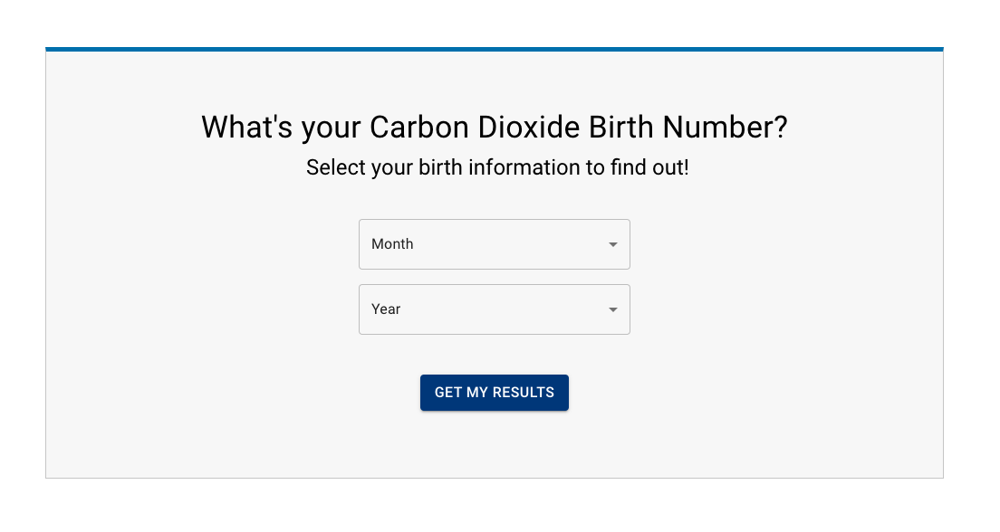
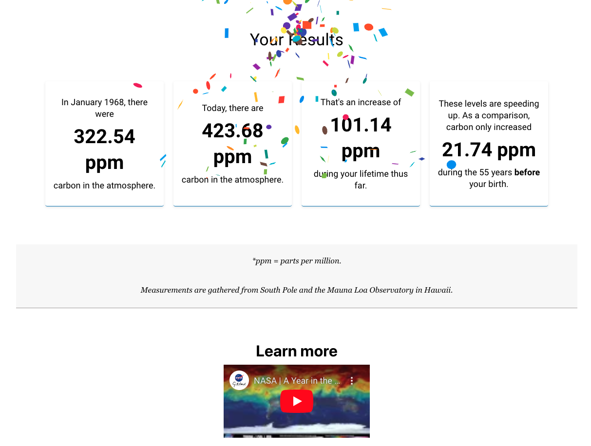

# Carbon Birth Calculator

Find yourt birth CO2 ppm metric and subsequent trends! Utilizing datasets from climate.nasa.gov and data.giss.nasa.gov, this app provides insight into carbon trends throughout your lifetime.

### About
I created functions leveraging extracted data to generate personalized metrics based on your birth information.

### Features

• Input your birthday to determine the corresponding carbon dioxide concentration for that period. 
• Understand the rise in CO2 levels over your lifetime with clear, simple metrics.

👉 [Find your carbon birth number](https://carbon-drab.vercel.app/)

## Demo

### Contact

Interested in chatting about climate or tech? Feel free to reach out!
Lauren.Swersky@gmail.com 🌎 💛
